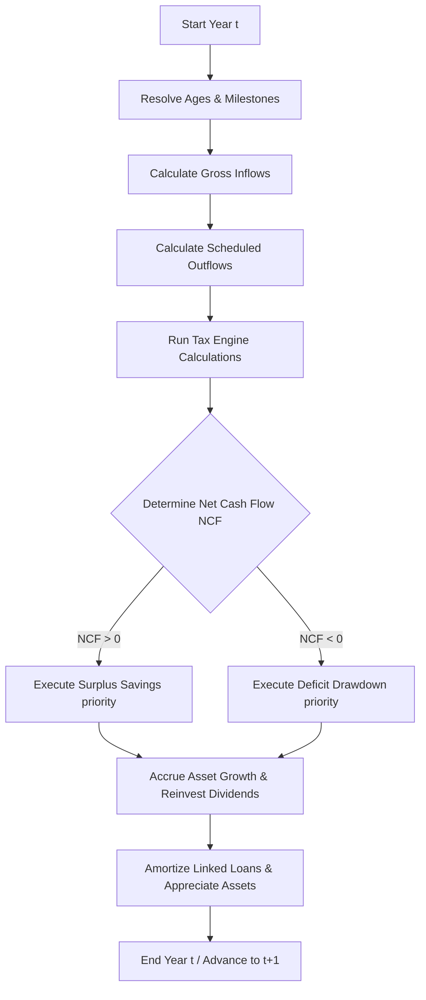

# Spec: Core Projection Engine (Sequence of Operations & Financial Logic)

> **Location**: Simulator Engine Backend (Web Worker / Calculation Service)
> **Purpose**: Detailed technical specification of the multi-year projection loop, account liquidation rules, IRS tax penalty checks, and surplus routing logic. This is the mathematical "brain" of the simulator.

---

## 1. Data Structures & State Initialization

Before starting the simulation loop, the engine initializes the financial state vector for Year $0$ (current year) based on user inputs:

```typescript
interface FinancialState {
  year: number;
  age: number;
  // Account Balances
  cashBalances: { [accountId: string]: number };
  taxableInvestments: { [accountId: string]: { balance: number; costBasis: number } };
  taxDeferredInvestments: { [accountId: string]: number }; // Traditional IRA / 401(k)
  taxFreeInvestments: { [accountId: string]: { balance: number; contributionsBasis: number } }; // Roth IRA / 401(k)
  hsaBalances: { [accountId: string]: number };
  // Real Assets & Outstanding Loans
  realAssets: { [assetId: string]: number };
  loans: { [loanId: string]: number };
}
```

---

## 2. The Annual Simulation Loop (Sequence of Operations)

For each year $t$ from $1$ to the planning horizon (defined by `lifeExpectancyAge` milestone):



### Step 1: Calendar Age Resolution & Milestone Triggers
*   Update current age: $\text{Age}_t = \text{Age}_0 + t$.
*   Check milestone flags (e.g., if $\text{Age}_t \geq \text{RetirementAge}$, enable retirement spending levels and start withdrawal sequencing).

### Step 2: Income Event Calculation
Sum all active inflows for year $t$:
$$\text{Gross Wages}_t = \sum \text{WageEvent}(t)$$
$$\text{Social Security}_t = \sum \text{SSEvent}(t) \times (1 + \text{benefitColaModifier})$$
$$\text{Pensions}_t = \sum \text{PensionEvent}(t) \times (1 + \text{benefitColaModifier})$$
$$\text{Other Inflows}_t = \sum \text{PassiveInflows}(t)$$
$$\text{Total Inflows}_t = \text{Gross Wages}_t + \text{Social Security}_t + \text{Pensions}_t + \text{Other Inflows}_t$$

### Step 3: Expense Event Calculation
Sum all active scheduled outflows for year $t$:
$$\text{Living Expenses}_t = \sum \text{ExpenseEvent}(t)$$
$$\text{Debt Payments}_t = \sum \text{AmortizedLoanPayments}(t)$$
$$\text{Total Scheduled Outflows}_t = \text{Living Expenses}_t + \text{Debt Payments}_t$$

### Step 4: Run Tax Engine Calculations
Calculate payroll taxes (FICA), federal, state, and local income taxes, plus property taxes based on filing status and location (see Module 6 for equations).
*   Let $T_t$ be the total estimated tax liability for the year.
*   Subtract tax withholding amounts already paid: $T_{\text{net}} = T_t - \text{withholdingAmount}_t$.
    *   *Default withholding rates*: 20% on tax-deferred distributions, 10% on taxable distributions.

### Step 5: Surplus / Deficit Determination
Compute the net cash flow ($\text{NCF}_t$):
$$\text{NCF}_t = \text{Total Inflows}_t - \text{Total Scheduled Outflows}_t - T_{\text{net}}$$

*   If $\text{NCF}_t > 0$: Proceed to **Step 6 (Surplus Savings)**.
*   If $\text{NCF}_t < 0$: Proceed to **Step 7 (Deficit Drawdown)**.

### Step 6: Surplus Savings Allocation Algorithm (Flows Loop)
If $\text{NCF}_t > 0$, the remaining surplus ($\text{Surplus} = \text{NCF}_t$) is allocated sequentially through the active plan `flows` ordered by `rank` (1 to N):

For each flow $F$ in the prioritized list:
1.  **Trigger Check**: Verify if year $t$ (or current owner ages) is within the flow's schedule duration. If not, skip to the next flow.
2.  **Determine Allocation Limit**: Compute maximum amount allowed for this step based on `ruleType`:
    *   *Percentage*: $\text{Limit} = \text{Wages}_t \times \text{ruleValue}$.
    *   *Maximize*: $\text{Limit} = \text{IRSLimit}_{\text{AccountType},t}$ (adjusting for age $\geq 50$ catch-up limits, e.g. \$7,000 + \$1,000 for Roth IRA).
    *   *Save/Maintain*: $\text{Limit} = \max(0, \text{targetBalance} - \text{CurrentBalance}_{t-1})$.
    *   *Save Leftover*: $\text{Limit} = \text{Surplus}$.
3.  **Execute Allocation**:
    $$\text{Allocation} = \min(\text{Surplus}, \text{Limit})$$
    $$\text{Surplus} = \text{Surplus} - \text{Allocation}$$
    $$\text{AccountBalance}_t = \text{AccountBalance}_{t-1} + \text{Allocation}$$
4.  **Process Employer Match**: If `employerMatch` is active:
    *   Calculate employee contribution percentage: $\text{EmployeePercent} = \frac{\text{Allocation}}{\text{Wages}_t}$.
    *   Calculate match rate: $\text{MatchPercent} = \min(\text{EmployeePercent}, \text{matchLimit}) \times \text{matchRate}$.
    *   Compute match: $\text{MatchAmount} = \text{Wages}_t \times \text{MatchPercent}$.
    *   Credit $\text{MatchAmount}$ to the `matchAccountId` (Traditional tax-deferred space). Note: This does *not* deduct from the employee's remaining `Surplus` pool.
5.  **Termination Check**: If $\text{Surplus} == 0$, terminate the loop.

*Fallback*: If the loop ends and $\text{Surplus} > 0$ (all flows filled), transfer the remaining surplus to the default taxable brokerage account (representing "Save anything left over").

### Step 7: Deficit Drawdown & Account Liquidation Algorithm
When NCF is negative, the engine must liquidate assets to cover the shortfall ($\text{Shortfall} = |\text{NCF}_t|$). The order depends on the selected `WithdrawalStrategy`:

#### A. Textbook Strategy Ordering
Draw from accounts in this exact sequence:
1.  **Cash/Savings Accounts**: Draw first until balance reaches zero.
2.  **Taxable Brokerage Accounts**:
    *   For each withdrawal, calculate capital gains tax owed:
        $$\text{Gain Ratio} = \frac{\text{Current Value} - \text{Cost Basis}}{\text{Current Value}}$$
        $$\text{Taxable Gain} = \text{Withdrawal} \times \text{Gain Ratio}$$
        $$\text{Tax Owed} = \text{Taxable Gain} \times \text{Capital Gains Tax Rate}$$
    *   Subtract withdrawal + tax owed from the taxable account balance.
3.  **Tax-Deferred Accounts (Traditional IRA / 401k)**:
    *   Withdrawals are treated as ordinary income and taxed at progressive rates.
    *   **Penalty Check**: If $\text{Age}_t < 59.5$, apply a **10% early withdrawal tax penalty** to the distribution.
4.  **Tax-Free Accounts (Roth IRA / 401k)**:
    *   **Basis First**: Withdrawals up to the accumulated contributions basis are tax-free and penalty-free at any age.
    *   **Earnings**: If basis is exhausted and $\text{Age}_t < 59.5$, earnings distributions are taxed as ordinary income and subject to a **10% penalty**. If $\text{Age}_t \geq 59.5$, earnings distributions are completely tax-free and penalty-free.

#### B. Proportional Drawdown Strategy
Instead of sequential liquidation, the shortfall is covered by withdrawing from all liquid accounts simultaneously, proportional to each account's share of total liquid assets:
$$\text{Allocation}_i = \frac{\text{Balance}_i}{\sum \text{LiquidBalances}} \times \text{Shortfall}$$
*   For each account, apply the appropriate tax and penalty calculations associated with its type.

#### C. Custom Order Strategy
Liquidate accounts according to a user-defined prioritized list of specific accounts, applying standard taxes and penalties.

### Step 8: Asset Growth & Yield Accrual
Apply growth to all asset classes:
*   **Dividends**: For taxable accounts, calculate dividend income:
    $$\text{Dividend}_t = \text{BrokerageBalance}_{t-1} \times \text{dividendYield}$$
    *   Tax dividends according to the Ordinary vs Qualified split (default 100% Qualified).
    *   If `reinvestDividends` is true, add dividend amount directly back to account balance and increase cost basis.
*   **Stocks Capital Growth**: Accrue growth on equity balances:
    $$B_{\text{stocks},t} = B_{\text{stocks},t-1} \times (1 + r_{\text{stocks}})$$
*   **Bonds Yield & Growth**: Accrue yields and growth on bond holdings, applying tax rules based on bond composition:
    *   *Municipal Bonds*: 100% tax-free at federal and state levels.
    *   *Treasury / Government Bonds*: Tax-free at state and local levels; fully taxable at federal levels.
    *   *Corporate / Other Bonds*: Fully taxable at federal and state levels.
*   **Derived Real Returns (Fixed Mode)**:
    $$\text{Real Return} = \frac{1 + \text{nominalGrowth} + \text{nominalYield}}{1 + \text{inflation}} - 1$$
*   **Historical Mode Loopback**:
    If the simulation timeline extends past the historical index bounds, the indices loop back to `loopbackYear` (default 1928) to continue generating annual returns.

### Step 9: Asset Appreciation & Loan Amortization
*   Appreciate real assets (e.g., real estate) by the appreciation rate:
    $$\text{AssetValue}_t = \text{AssetValue}_{t-1} \times (1 + \text{appreciationRate})$$
*   Amortize linked mortgages or debts, decreasing loan balances by principal payments made.

---

## 3. IRS Account Rules & Penalties

To ensure compliance with US retirement law, the simulation engine implements the following logic:

### 3.1 Required Minimum Distributions (RMDs)
For Traditional IRA and 401(k) accounts, starting at the mandatory age (currently age 73, transitioning to 75 by 2033), the owner must take an annual RMD:
$$\text{RMD}_t = \frac{\text{TraditionalBalance}_{t-1}}{\text{DistributionPeriod}_{\text{Age}_t}}$$

The engine uses the **IRS Uniform Lifetime Table (Table III)** distribution periods:

| Age | Distribution Period | Age | Distribution Period |
|---|---|---|---|
| **73** | 26.5 | **83** | 17.7 |
| **74** | 25.5 | **84** | 16.8 |
| **75** | 24.6 | **85** | 16.0 |
| **76** | 23.7 | **86** | 15.2 |
| **77** | 22.9 | **87** | 14.4 |
| **78** | 22.0 | **88** | 13.7 |
| **79** | 21.1 | **89** | 12.9 |
| **80** | 20.2 | **90** | 12.2 |
| **81** | 19.3 | **95** | 8.9 |
| **82** | 18.5 | **100** | 6.4 |

*Note: If the required RMD exceeds the year's spending needs, the forced distribution is taxed as ordinary income and the net cash is transferred to the taxable brokerage account.*

### 3.2 HSA Medical Spending
*   Withdrawals used for simulated healthcare/medical expenses are 100% tax-free at any age.
*   Non-medical withdrawals before Age 65 are subject to ordinary income tax + **20% tax penalty**.
*   Non-medical withdrawals after Age 65 are subject to ordinary income tax (no penalty).

---

## 4. Integration Architecture & Database Schema

A coding agent can implement the simulation state storage using this relational schema (Drizzle ORM / PostgreSQL):

```typescript
import { pgTable, uuid, varchar, doublePrecision, boolean, integer, jsonb } from "drizzle-orm/pg-core";

export const plans = pgTable("plans", {
  id: uuid("id").primaryKey().defaultRandom(),
  name: varchar("name", { length: 255 }).notNull(),
  userId: uuid("user_id").notNull(),
  retirementAge: integer("retirement_age").default(60).notNull(),
  lifeExpectancyAge: integer("life_expectancy_age").default(100).notNull(),
  withdrawalMethod: varchar("withdrawal_method", { length: 50 }).default("textbook").notNull(),
  customWithdrawalOrder: jsonb("custom_withdrawal_order"), // Array of account names
  createdAt: varchar("created_at").notNull(),
});

export const planAccounts = pgTable("plan_accounts", {
  id: uuid("id").primaryKey().defaultRandom(),
  planId: uuid("plan_id").references(() => plans.id, { onDelete: "cascade" }),
  name: varchar("name", { length: 255 }).notNull(),
  owner: varchar("owner", { length: 50 }).default("primary").notNull(),
  type: varchar("type", { length: 50 }).notNull(), // taxable, roth_ira, traditional_ira, cash, hsa
  balance: doublePrecision("balance").default(0).notNull(),
  costBasis: doublePrecision("cost_basis").default(0).notNull(),
  annualContribution: doublePrecision("annual_contribution").default(0).notNull(),
  growthRate: doublePrecision("growth_rate").default(7.0).notNull(),
  dividendYield: doublePrecision("dividend_yield").default(2.0).notNull(),
  reinvestDividends: boolean("reinvest_dividends").default(true).notNull(),
});

export const planEvents = pgTable("plan_events", {
  id: uuid("id").primaryKey().defaultRandom(),
  planId: uuid("plan_id").references(() => plans.id, { onDelete: "cascade" }),
  name: varchar("name", { length: 255 }).notNull(),
  category: varchar("category", { length: 50 }).notNull(), // income, expense
  type: varchar("type", { length: 50 }).notNull(), // salary, pension, living_expense, healthcare
  amount: doublePrecision("amount").notNull(),
  growthRate: doublePrecision("growth_rate").default(0).notNull(),
  adjustForInflation: boolean("adjust_for_inflation").default(true).notNull(),
  startTriggerType: varchar("start_trigger_type", { length: 50 }).notNull(),
  startTriggerValue: integer("start_trigger_value"),
  endTriggerType: varchar("end_trigger_type", { length: 50 }).notNull(),
  endTriggerValue: integer("end_trigger_value"),
});
```
