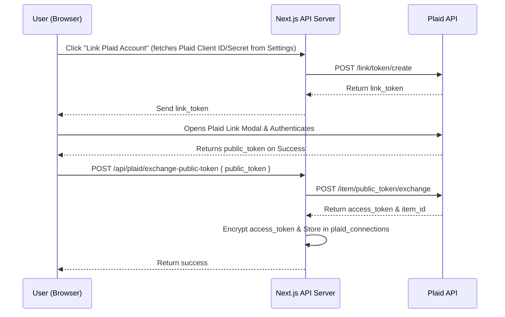

# Plaid Sync Integration Architecture Plan

This document outlines the high-level architecture changes required to support syncing bank accounts and transactions via Plaid in Runway Finance, running concurrently with the existing SimpleFIN sync.

## Goal & Scope
- **Simultaneous Providers**: Users can connect both SimpleFIN and Plaid accounts, or choose either.
- **Provider Choice & Switching**: A clear mechanism to determine which bank accounts sync via which provider, with simple options to disconnect or switch.
- **Plaid API Credentials**: Configurable via the settings UI (stored encrypted in the database per-user).
- **Plaid Sandbox Support**: Easy toggling of environment (Sandbox vs. Development vs. Production) for testing.

---

## Architecture Overview

Plaid integration involves three main layers:
1. **Frontend Plaid Link integration**: Launching the bank connection interface.
2. **Backend OAuth / Credentials exchange**: Exchanging a public token for a permanent access token, and storing it encrypted.
3. **Plaid Sync service**: Fetching account balances and incremental transaction updates using Plaid's `/transactions/sync` cursor-based API.



---

## 1. Database Schema Changes

To keep the database clean, modular, and backwards-compatible:
1. Retain the `simplefin_connections` table unchanged to preserve existing users' data.
2. Create a new `plaid_connections` table.
3. Update the `accounts` and `sync_logs` tables to include optional foreign keys to `plaid_connections`.

### Drizzle Schema Additions (`lib/db/schema.ts`)

```typescript
// ── Plaid Connections ────────────────────────────────────────────────────────
export const plaidConnections = pgTable('plaid_connections', {
  id: uuid('id').primaryKey().defaultRandom(),
  userId: text('user_id').notNull(),
  accessTokenEncrypted: text('access_token_encrypted').notNull(),
  accessTokenIv: text('access_token_iv').notNull().default(''), // Mimics SimpleFIN encryption envelope
  accessTokenTag: text('access_url_tag').notNull().default(''),
  itemId: text('item_id').notNull(),
  institutionId: text('institution_id'),
  institutionName: text('institution_name'),
  cursor: text('cursor'), // Cursor for incremental /transactions/sync
  label: text('label').notNull().default('Plaid Connection'),
  syncFrequency: text('sync_frequency').notNull().default('manual'),
  lastSyncAt: timestamp('last_sync_at', { withTimezone: true }),
  lastSyncStatus: text('last_sync_status').notNull().default('pending'),
  lastSyncError: text('last_sync_error'),
  createdAt: timestamp('created_at', { withTimezone: true }).notNull().defaultNow(),
});
```

### Drizzle Schema Modifications (`lib/db/schema.ts`)

```diff
// ── Accounts ─────────────────────────────────────────────────────────────────
export const accounts = pgTable(
  'accounts',
  {
    id: uuid('id').primaryKey().defaultRandom(),
    userId: text('user_id').notNull(),
    connectionId: uuid('connection_id')
      .references(() => simplifinConnections.id, { onDelete: 'cascade' }),
+   plaidConnectionId: uuid('plaid_connection_id')
+     .references(() => plaidConnections.id, { onDelete: 'cascade' }),
    externalId: text('external_id').notNull(),
    name: text('name').notNull(),
    currency: text('currency').notNull().default('USD'),
    balance: text('balance').notNull(),
    balanceDate: timestamp('balance_date', { withTimezone: true }),
    type: text('type').notNull(),
    metadata: text('metadata'),
    institution: text('institution'),
    isHidden: boolean('is_hidden').notNull().default(false),
    isExcludedFromNetWorth: boolean('is_excluded_from_net_worth').notNull().default(false),
    displayOrder: integer('display_order').notNull().default(0),
    createdAt: timestamp('created_at', { withTimezone: true }).notNull().defaultNow(),
    updatedAt: timestamp('updated_at', { withTimezone: true }).notNull().defaultNow(),
  },
- (t) => [unique().on(t.connectionId, t.externalId)]
+ (t) => [
+   unique().on(t.connectionId, t.externalId),
+   unique().on(t.plaidConnectionId, t.externalId)
+ ]
);

// ── Sync Logs ────────────────────────────────────────────────────────────────
export const syncLogs = pgTable('sync_logs', {
  id: uuid('id').primaryKey().defaultRandom(),
  userId: text('user_id').notNull(),
  connectionId: uuid('connection_id').references(() => simplifinConnections.id),
+ plaidConnectionId: uuid('plaid_connection_id').references(() => plaidConnections.id),
  startedAt: timestamp('started_at', { withTimezone: true }).notNull().defaultNow(),
  completedAt: timestamp('completed_at', { withTimezone: true }),
  status: text('status').notNull(),
  accountsSynced: text('accounts_synced').notNull(),
  transactionsFetched: text('transactions_fetched').notNull(),
  transactionsNew: text('transactions_new').notNull(),
  errorMessage: text('error_message'),
  durationMs: text('duration_ms'),
  details: text('details'),
});
```

### Encryption Mapping (`lib/crypto.ts`)
Add Plaid-related fields to the list of `ENCRYPTED_FIELDS` to ensure transparent encryption at rest:
```typescript
plaid_connections: ['accessTokenEncrypted', 'accessTokenIv', 'accessTokenTag'],
```

---

## 2. API Credentials Configuration

Plaid API credentials will be stored encrypted in the existing `apiKeys` field within `user_settings`.

Update `config/defaults.ts` (`API_KEY_DEFAULTS`):
```typescript
export const API_KEY_DEFAULTS: Record<string, string> = {
  // Existing keys ...
  plaidClientId: '',
  plaidSecret: '',
  plaidEnvironment: 'sandbox', // 'sandbox' | 'development' | 'production'
};
```
These will automatically appear in Settings -> Advanced for the user to securely input and toggle.

---

## 3. Plaid API Integration

A dedicated Plaid helper service (`lib/plaid.ts`) will manage API calls to Plaid:
1. **Initialize API Client**: Constructs request configs targeting the environment URL specified in the user's `apiKeys` (`sandbox`, `development`, or `production`).
2. **Link Token Generation**: Call `/link/token/create` with standard payload including the client ID, secret, client name, user ID, language, country codes (`['US', 'CA']`), and product list (`['transactions']`).
3. **Public Token Exchange**: Call `/item/public_token/exchange` to claim the access token.
4. **Transactions Sync**: Call `/transactions/sync` recursively using the `cursor` to get all new, updated, and deleted transactions.

---

## 4. Backend Route Implementations

Four endpoints will handle Plaid operations:

- **`POST /api/plaid/create-link-token`**:
  - Fetches the user's decrypted Plaid client ID and secret from settings.
  - Returns a `link_token` for the frontend.
- **`POST /api/plaid/exchange-public-token`**:
  - Receives `public_token` and `institutionName`/`institutionId`.
  - Exchanged it for `access_token` and `item_id` via Plaid API.
  - Encrypts `access_token` using the user's session DEK.
  - Inserts a new row into `plaid_connections` table.
- **`POST /api/plaid/sync`**:
  - Manual sync handler for a given Plaid connection ID.
- **`DELETE /api/connections/plaid/[id]`**:
  - Deletes a Plaid connection and cascades to delete all linked accounts.

---

## 5. Sync Service & Scheduler

### A. Plaid Sync Job (`lib/services/plaid-sync.ts`)
A service function `syncPlaidConnection(connectionId, userId, dek)` will mimic the SimpleFIN `syncConnection` workflow:
1. Decrypt `access_token` using the DEK.
2. Fetch cursor from the connection row.
3. Call `/transactions/sync` from Plaid.
4. Process accounts returned by Plaid:
   - Match/upsert rows in `accounts` table using `plaidConnectionId` and Plaid's `account_id` as the `externalId`.
5. Process transaction updates:
   - **Added/Modified**: Encrypt sensitive details and upsert into the `transactions` table.
   - **Removed**: Match `externalId` and set `deleted = true` in the database.
6. Apply transaction categorization rules and AI categorizer.
7. Perform downstream updates (Net Worth snapshot, Cash Flow summaries, Category summaries).
8. Record state in `sync_logs` and update `plaid_connections` with the new sync cursor and timestamps.

### B. Scheduler Updates (`lib/services/sync-scheduler.ts`)
The `SyncScheduler` class will be expanded to retrieve and schedule background sync runs for **both** SimpleFIN and Plaid connections:
- In `init()` and `scheduleForUser()`, query both tables.
- Reschedule Plaid connections on failure using the standard 30-minute retry interval.

---

## 6. Frontend UI Integration

### A. Settings View (`app/settings/page.tsx`)
Within the Settings tab under **Accounts -> Automatic Accounts**:
- Split the section into **SimpleFIN Bridge** and **Plaid Connections** (or a single layout displaying all active bank links with their respective logos/badges).
- Add a "Link Bank via Plaid" button.
  - Loads `<script src="https://cdn.plaid.com/link/v2/stable/link-initialize.js"></script>` dynamically or uses a wrapper.
  - Requests `/api/plaid/create-link-token`.
  - Instantiates Plaid Link with the token.
  - On success, sends `public_token` to `/api/plaid/exchange-public-token`.
- Support individual manual sync, details review, custom labels, scheduling adjustments, and connection deletion for Plaid items.

### B. Account Detail Drawer (`components/features/accounts/AccountDetailDrawer.tsx`)
- Detect if the account has a `plaidConnectionId`.
- If set, show a "Plaid Synced" badge.
- Allow disconnecting from bank sync (sets `plaidConnectionId = null`), converting it to a manual/orphaned account.

### C. Account Re-mapping / Switching
Remapping is the core mechanism used to choose which backend syncs which account, or to switch from one backend to the other:
- Update `/api/accounts/remap` POST route:
  ```typescript
  // Copy target's sync parameters to source
  await tx.update(accounts).set({
    connectionId: targetAccount.connectionId,
    plaidConnectionId: targetAccount.plaidConnectionId, // Add this!
    externalId: targetAccount.externalId,
    balance: targetAccount.balance,
    balanceDate: targetAccount.balanceDate,
    institution: targetAccount.institution,
    updatedAt: new Date(),
  }).where(eq(accounts.id, sourceAccountId));
  ```
- **Switching Scenario**: If a user currently syncs "Chase Checking" through SimpleFIN and wants to switch to Plaid:
  1. User connects Chase via Plaid. A new "Chase Checking (Plaid)" account is created.
  2. User goes to the old "Chase Checking (SimpleFIN)" settings, and clicks "Unlink from Bank Sync". It is now manual.
  3. User clicks "Re-map Account" on settings, selecting the old "Chase Checking" as source and the new "Chase Checking (Plaid)" as target.
  4. The system deletes the duplicate transactions/snapshots, shifts Plaid credentials/history, deletes the temporary Plaid account, and points the historical account to Plaid!

---

## 7. Verification Plan

### Plaid Sandbox Testing
1. Configure credentials with `plaidClientId`, `plaidSecret`, and `plaidEnvironment = 'sandbox'`.
2. Connect accounts via Plaid Link (using test credentials: username `user_good`, password `pass_good`).
3. Verify that:
   - Connection displays in the UI.
   - Account balances are fetched correctly.
   - Initial transactions are backfilled and categorized using existing rules.
4. Force sync trigger and verify that incremental updates are captured.
5. Remap a SimpleFIN account to Plaid and verify historical transaction retention.

### Automated Tests
- Unit tests for Plaid client wrapper (`lib/plaid.ts`).
- Integration tests for public token exchanges, and sync cursor saving.
