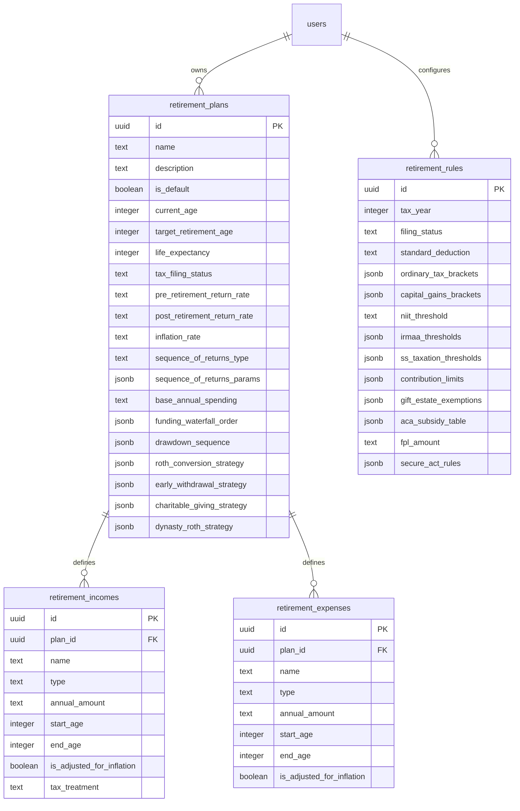

# Specification: USA Retirement & FIRE Projection Engine

This document details the architectural design, mathematical formulas, data models, and algorithms for the USA Retirement & FIRE Projection Engine.

---

## 1. Core Mathematical Modeling & Calculations

### 1.1 Federal Income Tax & Standard Deduction
Taxes are calculated annually for ordinary income and capital gains. 
Ordinary taxable income is computed as:
$$TaxableOrdinaryIncome = \max\left(0, GrossOrdinaryIncome - StandardDeduction\right)$$
where $GrossOrdinaryIncome$ is the sum of:
- Portfolio ordinary withdrawals (Pre-tax / Tax-Deferred accounts like Traditional IRA/401k)
- Pension payments
- Ordinary rental income or annuities
- Part-time employment earnings
- Taxable portion of Social Security benefits

Ordinary tax is calculated progressively using progressive tax brackets:
$$Tax_{ord} = \sum_{i} \text{rate}_i \times \text{taxableAmountInBracket}_i$$

### 1.2 Long-Term Capital Gains & NIIT
Long-Term Capital Gains (LTCG) are taxed at separate progressive rates (0%, 15%, 20%). The taxable capital gains are added on top of ordinary income to determine the bracket boundaries.
The Net Investment Income Tax (NIIT) of 3.8% is applied to the lesser of:
1. Net investment income (realized capital gains, taxable dividends, interest)
2. The excess of Modified Adjusted Gross Income (MAGI) over the NIIT threshold ($200,000 for Single, $250,000 for Married Filing Jointly).

### 1.3 Social Security Taxation (Combined Income)
Social Security benefits are taxed based on "Combined Income" (also known as Provisional Income):
$$CombinedIncome = AGI_{non-SS} + TaxExemptInterest + \frac{1}{2} \times SocialSecurityBenefit$$
The taxable amount of Social Security is determined by two thresholds:
- **Tier 1**: $25,000 (Single) / $32,000 (MFJ)
- **Tier 2**: $34,000 (Single) / $44,000 (MFJ)

Taxable portion formula:
- If Combined Income $\le$ Tier 1: Taxable SS = 0.
- If Tier 1 < Combined Income $\le$ Tier 2: Taxable SS is the lesser of:
  - $0.5 \times (CombinedIncome - Tier 1)$
  - $0.5 \times SocialSecurityBenefit$
- If Combined Income > Tier 2: Taxable SS is the lesser of:
  - $0.85 \times (CombinedIncome - Tier 2) + \min(0.5 \times SocialSecurityBenefit, 0.5 \times [Tier 2 - Tier 1])$
  - $0.85 \times SocialSecurityBenefit$

### 1.4 Medicare & IRMAA Premiums
Medicare Part B and Part D premiums are determined by the user's MAGI from **two years prior** to the projection year.
If MAGI falls into one of the 5 IRMAA surcharge tiers, the base premiums are increased:
- Tier 1: MAGI $\le$ Base limit (no surcharge)
- Tiers 2-5: Surcharges added progressively to Part B and Part D.

### 1.5 ACA Marketplace Subsidies (Pre-Age 65)
Prior to Medicare eligibility at age 65, the user is assumed to purchase health insurance via the ACA marketplace.
1. The engine calculates MAGI as:
   $$MAGI = AGI + TaxExemptInterest + TaxableSocialSecurity$$
2. MAGI is compared to the Federal Poverty Level (FPL) to determine the percentage of FPL.
3. The benchmark premium cap (percentage of MAGI) is looked up in the ACA subsidy tables.
4. The premium subsidy (Premium Tax Credit) is:
   $$Subsidy = \max\left(0, BenchmarkSilverPremium - (MAGI \times PremiumCapPercent)\right)$$
5. The net healthcare expense is:
   $$NetExpense = \max\left(0, SelectedInsurancePremium - Subsidy\right)$$

### 1.6 Required Minimum Distributions (RMDs)
Starting at the RMD age (73 for birth years 1951-1959, 75 for 1960+), the user must withdraw a minimum percentage from all Tax-Deferred (Traditional) accounts:
$$RMD_{year} = \frac{TaxDeferredBalance_{Dec31-PriorYear}}{UniformDistributionPeriod}$$
where $UniformDistributionPeriod$ is looked up in the IRS Uniform Lifetime Table for the user's age. RMDs are taxed as ordinary income. If the RMD exceeds the user's spending needs, the excess is moved to the Taxable Brokerage account.

---

## 2. Dynamic Algorithmic Workflows

### 2.1 The Iterative Tax-Withdrawal Solver
Since withdrawals from tax-deferred accounts increase ordinary income, which increases taxes, which requires *more* withdrawals, a circular dependency exists. The engine solves this using an iterative solver:

```typescript
function solveWithdrawal(netRequiredSpend: number, balances: Portfolio, rules: TaxRules): WithdrawalResult {
  let grossWithdrawal = netRequiredSpend;
  let taxEstimated = 0;
  let iterations = 0;
  const MAX_ITERATIONS = 10;
  const EPSILON = 0.01;

  while (iterations < MAX_ITERATIONS) {
    const totalCashIn = grossWithdrawal;
    const ordinaryIncome = calculateOrdinaryWithdrawals(grossWithdrawal, balances);
    const capitalGains = calculateCapitalGains(grossWithdrawal, balances);
    
    const taxCurrent = calculateTaxes(ordinaryIncome, capitalGains, rules);
    const deficit = (netRequiredSpend + taxCurrent) - totalCashIn;

    if (Math.abs(deficit) < EPSILON) {
      taxEstimated = taxCurrent;
      break;
    }
    grossWithdrawal += deficit;
    iterations++;
  }
  return { grossWithdrawal, taxEstimated };
}
```

### 2.2 Pre-Retirement Funding Waterfall
Contributions are routed each year based on the following prioritizations:
1. **Employer Match**: Contribute to Traditional/Roth 401(k) up to employer matching percentage (highest instant return).
2. **HSA Max**: Contribute to HSA up to maximum limit (triple tax-advantaged).
3. **IRA / Roth IRA Max**: Max out Roth IRA or Traditional IRA (based on current vs. expected tax bracket).
4. **Unmatched 401(k) Max**: Contribute remaining capacity to 401(k).
5. **Mega Backdoor Roth**: If configured, contribute after-tax funds to 401(k) and roll over to Roth.
6. **Taxable Brokerage**: Route all remaining savings to taxable investment accounts.

### 2.3 Post-Retirement Withdrawal Sequencing (Drawdown)
Withdrawals to cover the spending deficit are executed in sequence:
1. **RMDs**: Forced first.
2. **Taxable Brokerage**: Liquidated first to allow tax-advantaged accounts to compound.
3. **Tax-Deferred Accounts**: Liquidated second.
4. **Tax-Free (Roth) Accounts**: Liquidated last.
5. **HSA**: Retained for medical expenses or liquidated penalty-free after age 65.

*Alternative strategies (e.g. Proportional, or filling brackets via Roth Conversions) can override this order.*

---

## 3. Database Schema Design



---

## 4. Timeline Milestones & Gates

The projection engine tracks and highlights important dates:
- **Age 50**: Catch-up contributions enabled (IRA + 401k limits increase).
- **Age 55**: **Rule of 55** matches. Users separating from service can withdraw from current employer 401(k) penalty-free.
- **Age 59.5**: Penalty-free withdrawals from all Traditional/Roth retirement accounts.
- **Age 62**: Earliest age to claim Social Security (benefits reduced).
- **Age 65**: Medicare eligibility starts (ACA subsidy window closes).
- **Age 67**: Full Retirement Age (FRA) for Social Security (for birth years $\ge$ 1960).
- **Age 70**: Maximum benefit age for Social Security (delayed retirement credits max out).
- **Age 73 / 75**: RMD start date.

---

## 5. Sequence of Return Risk Projections

To assess portfolio survivability, the engine supports three simulation models:

### 5.1 Deterministic (Straight-Line)
Assumes constant nominal or real return rates during pre-retirement and post-retirement phases.

### 5.2 Stochastic (Monte Carlo Simulation)
Runs $N$ independent trials (default 250). For each trial, returns are randomly generated:
$$Return_{year} \sim \mathcal{N}(\mu, \sigma^2)$$
where $\mu$ is the expected nominal return and $\sigma$ is the asset-allocation volatility (estimated or configured). Output displays $10^{th}$, $50^{th}$ (median), and $90^{th}$ percentile net worth pathways, along with the percentage of successful trials.

### 5.3 Historical Backtesting (Sequence of Returns)
Extracts annual real returns from historical S&P 500 and US Treasury bond data. The simulation runs $M$ periods, where each period models retiring in a specific year (e.g. 1929, 1966, 1973, 2000, 2008). 
This reports:
- **Survival Rate**: % of historical cohorts that did not deplete their money.
- **Worst Cohort**: The historical starting year that resulted in the lowest ending net worth (usually 1966 or 1929).
- **Best Cohort**: The historical starting year with the highest ending net worth.
